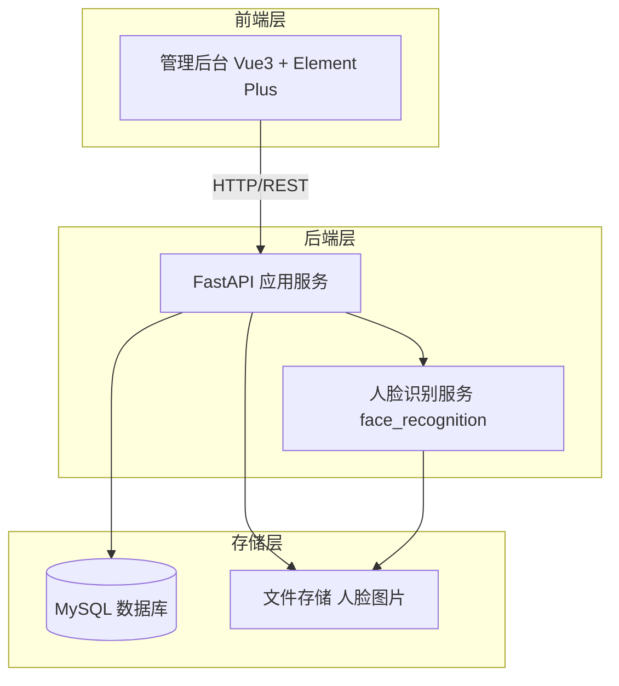
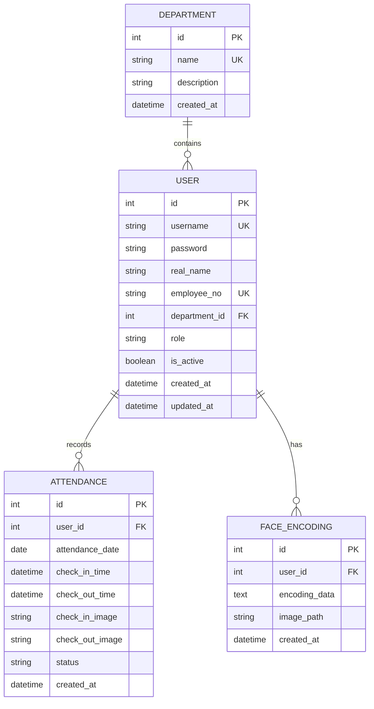

# 人脸识别考勤系统 - 项目设计文档

## 1. 系统架构

## 2. ER 图

## 3. 接口清单

### 3.1 认证模块 (AuthController)

| 方法 | 路径             | 描述             |
| ---- | ---------------- | ---------------- |
| POST | /api/auth/login  | 用户登录         |
| POST | /api/auth/logout | 用户登出         |
| GET  | /api/auth/me     | 获取当前用户信息 |

### 3.2 用户管理 (UserController)

| 方法   | 路径                 | 描述         |
| ------ | -------------------- | ------------ |
| GET    | /api/users           | 获取用户列表 |
| POST   | /api/users           | 创建用户     |
| PUT    | /api/users/{id}      | 更新用户     |
| DELETE | /api/users/{id}      | 删除用户     |
| POST   | /api/users/{id}/face | 上传人脸照片 |

### 3.3 部门管理 (DepartmentController)

| 方法   | 路径                  | 描述         |
| ------ | --------------------- | ------------ |
| GET    | /api/departments      | 获取部门列表 |
| POST   | /api/departments      | 创建部门     |
| PUT    | /api/departments/{id} | 更新部门     |
| DELETE | /api/departments/{id} | 删除部门     |

### 3.4 考勤管理 (AttendanceController)

| 方法 | 路径                       | 描述         |
| ---- | -------------------------- | ------------ |
| POST | /api/attendance/check-in   | 人脸签到     |
| POST | /api/attendance/check-out  | 人脸签退     |
| GET  | /api/attendance            | 获取考勤记录 |
| GET  | /api/attendance/statistics | 考勤统计     |

## 4. UI/UX 规范

### 4.1 色彩系统

- 主色调: `#409EFF` (Element Plus 默认蓝)
- 成功色: `#67C23A`
- 警告色: `#E6A23C`
- 危险色: `#F56C6C`
- 背景色: `#F5F7FA`
- 卡片背景: `#FFFFFF`

### 4.2 字体规范

- 主字体: `"Helvetica Neue", Helvetica, "PingFang SC", Arial, sans-serif`
- 标题字号: 20px / 18px / 16px
- 正文字号: 14px
- 辅助文字: 12px

### 4.3 间距规范

- 页面边距: 24px
- 卡片间距: 16px
- 元素间距: 8px / 12px / 16px

### 4.4 圆角规范

- 卡片圆角: 8px
- 按钮圆角: 4px
- 输入框圆角: 4px
